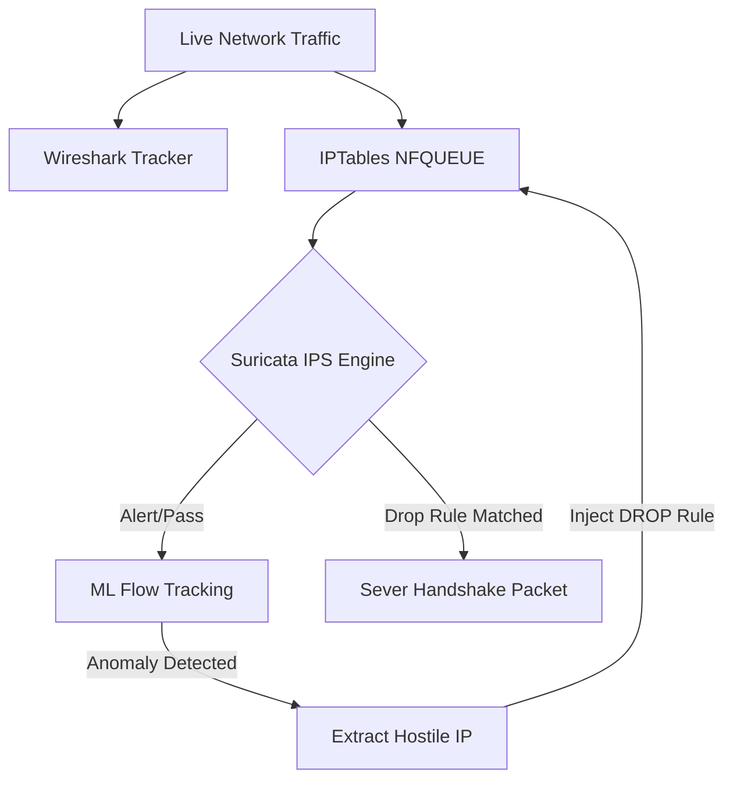

# 🛡️ Encrypted-Traffic-Analysis-using-Suricata


## 📌 Overview
This project provides an advanced, battle-tested **Intrusion Prevention System (IPS)** and **Dynamic Firewall Automation** toolkit. Since deep packet inspection is impossible on fully encrypted payloads, this engine heavily relies on **flow behavior, TLS handshake metadata, JA3 fingerprints, and Unsupervised Machine Learning** to actively track, neutralize, and block encrypted threats.

## 🚀 The Track, Prevent, Block Engine
We execute a definitive 3-stage defense methodology:

1. **TRACK (ML Subsystem):** Captures traffic and utilizes Scikit-Learn's *Isolation Forest* to algorithmically detect anomalous volume/duration flow ratios.
2. **PREVENT (Inline IPS):** Runs Suricata natively in inline `NFQUEUE` mode, intercepting packets and immediately dropping handshakes matching known malicious signatures.
3. **BLOCK (Dynamic Firewall):** Extracts hostile IPs from the ML anomaly detector and automatically injects strict `iptables DROP` rules to permanently sever their host connections.

### 🏗 Architecture Flow


## 🛠 Tech Stack & Failsafes
- **Python 3.8+** (CLI, Orchestration, Analysis)
- **Suricata** (IDS/IPS Engine)
- **Scikit-Learn & Pandas** (Machine Learning Tracking)
- **IPTables / NFQUEUE** (Active Firewall Blocking)
- **Plotly** (Interactive Web Dashboard)

### 🛡️ Iron-Clad Reliability
Because this tool natively hooks into your operating system's firewall, we have engineered aggressive safety tolerances:
- **Bulletproof Cleanups:** Even if the capture abruptly terminates or crashes, strictly bound `atexit` routines guarantee all `iptables` constraints are cleanly scrubbed. *No permanent network lockouts.*
- **Pre-Flight Sanity Checks:** The controller audits system requirements (`tshark`, `suricata`, `iptables`) before allowing operation execution.
- **Resilient Parsing:** ML ingestion safely bypasses incomplete or corrupted Suricata `eve.json` records.

---

## 📂 Project Structure
```text
Encrypted-Traffic-Analysis-using-Suricata/
│
├── run.sh                 # 1-Click Automated Pipeline Runner
├── controller.py          # Master CLI Orchestrator
├── wireshark_capture.py   # Traffic Tracking module
├── suricata_run.py        # Suricata execution & IPS Prevention module
├── analysis.py            # ML Anomaly Detection & IPTables Blocking module
│
├── requirements.txt       # Python dependencies
└── project_output/        # Auto-generated outputs (Logs & HTML Reports)
```

## ⚙️ Installation & Setup

### Prerequisites
- Linux Environment (Ubuntu / Debian / Kali recommended)
- `sudo` privileges (required for `iptables` and NFQUEUE routing)
- Core binaries installed:
  ```bash
  sudo apt-get update
  sudo apt-get install suricata tshark python3-pip -y
  ```

### Install Python Dependencies
```bash
pip3 install -r requirements.txt
```

---

## 🚦 How to Use (The Controller)

The entire project has been consolidated into a master orchestrated CLI. 

### The 1-Click Automated Runner (Recommended)
You can automate the entire **Track, Prevent, Block** active pipeline simply by executing the bundled bash script. The script automatically detects your active network interface, ensures all python dependencies are installed, and runs the core python ML / IPS orchestrator.

```bash
sudo chmod +x run.sh
sudo ./run.sh 60
```
*(The `60` parameter represents the capture duration in seconds. The script defaults to 60 if left blank).*

> **Note:** Generate HTTPS traffic (`curl https://example.com` or web browsing) while the script is listening to feed the Machine Learning tracker!

### Manual CLI Options (Python Controller)
```text
options:
  -h, --help            Show help message
  --capture             Run Wireshark capture (Track)
  --interface IFACE     Network interface (Default: eth0)
  --duration SECS       Capture/Suricata duration (Default: 30)
  --suricata            Run Suricata engine
  --ips                 Run Suricata directly in Inline IPS Mode (Prevent)
  --analyze             Run ML Analysis and generate HTML report (Track)
  --block               Dynamically isolate anomalous IPs via Firewall (Block)
  --all                 Run full Track, Prevent, Block pipeline
```

---

## 📊 The Interactive Dashboard
After the command completes, an interactive HTML dashboard is generated at:
`project_output/analysis/report.html`

The comprehensive dossier features:
- **Active Summary:** Total connections vs active Blocked ML Anomalies.
- **Plotly Flow Map:** Interactive scatter mapping Server vs Client byte exchanges for severed anomalous connections.
- **TLS Metadata:** TLS version distributions & Top JA3 fingerprints chart.
- **Firewall Hitlist:** A table documenting the specific IP Addresses successfully banished by automated firewall logic.

---

## ⚠️ Disclaimer
Running the `--all` or `--ips` flags will immediately hook traffic into Linux `NFQUEUE`. This engine is designed for active disruption of hostile network traffic. Run in a controlled testing environment, as the Machine Learning engine dynamically permanently drops traffic from sources if they exhibit extreme volume flow anomalies.
